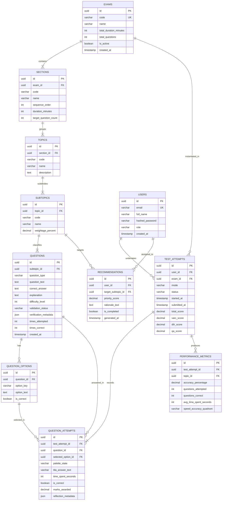

# Relational Database Schema & Persistence Architecture

---

## 1. Entity-Relationship (ER) Diagram

---

## 2. Table Specifications & Column DDL

### Table 1: `exams`
*Stores top-level standardized exam profiles.*
* `id` (`UUID`, Primary Key, `DEFAULT gen_random_uuid()`)
* `code` (`VARCHAR(32)`, Unique, Not Null) — e.g., `"CAT-2026"`
* `name` (`VARCHAR(128)`, Not Null) — e.g., `"Common Admission Test 2026"`
* `total_duration_minutes` (`INTEGER`, Not Null, `CHECK (total_duration_minutes > 0)`) — `120`
* `total_questions` (`INTEGER`, Not Null, `CHECK (total_questions > 0)`) — `66`
* `is_active` (`BOOLEAN`, Not Null, `DEFAULT TRUE`)
* `created_at` (`TIMESTAMPTZ`, Not Null, `DEFAULT NOW()`)

### Table 2: `sections`
*Stores sequential timed sections belonging to an exam.*
* `id` (`UUID`, Primary Key)
* `exam_id` (`UUID`, Foreign Key $\to$ `exams(id)` ON DELETE CASCADE, Not Null)
* `code` (`VARCHAR(32)`, Not Null) — `"VARC"`, `"DILR"`, `"QA"`
* `name` (`VARCHAR(128)`, Not Null)
* `sequence_order` (`INTEGER`, Not Null, `CHECK (sequence_order >= 1)`) — `1, 2, 3`
* `duration_minutes` (`INTEGER`, Not Null, `CHECK (duration_minutes > 0)`) — `40`
* `target_question_count` (`INTEGER`, Not Null, `CHECK (target_question_count > 0)`)
* **Constraint:** `UNIQUE (exam_id, sequence_order)` — guarantees unique sequential ordering per exam.

### Table 3: `topics` & `subtopics`
*Hierarchical syllabus taxonomy.*
* `topics`:
  - `id` (`UUID`, Primary Key)
  - `section_id` (`UUID`, Foreign Key $\to$ `sections(id)` ON DELETE CASCADE, Not Null)
  - `code` (`VARCHAR(64)`, Not Null) — `"QA-ARITHMETIC"`, `"QA-ALGEBRA"`
  - `name` (`VARCHAR(128)`, Not Null)
* `subtopics`:
  - `id` (`UUID`, Primary Key)
  - `topic_id` (`UUID`, Foreign Key $\to$ `topics(id)` ON DELETE CASCADE, Not Null)
  - `code` (`VARCHAR(64)`, Not Null) — `"QA-ARITH-TSD"`, `"QA-NUM-REMAINDERS"`
  - `name` (`VARCHAR(128)`, Not Null)
  - `weightage_percent` (`NUMERIC(5,2)`, Nullable)

### Table 4: `questions`
*Core question bank items.*
* `id` (`UUID`, Primary Key)
* `subtopic_id` (`UUID`, Foreign Key $\to$ `subtopics(id)` ON DELETE RESTRICT, Not Null)
* `question_type` (`VARCHAR(16)`, Not Null, `CHECK (question_type IN ('MCQ', 'TITA'))`)
* `question_text` (`TEXT`, Not Null)
* `correct_answer` (`TEXT`, Not Null)
* `explanation` (`TEXT`, Not Null)
* `difficulty_level` (`INTEGER`, Not Null, `CHECK (difficulty_level BETWEEN 1 AND 5)`)
* `validation_status` (`VARCHAR(32)`, Not Null, `CHECK (validation_status IN ('PENDING_VALIDATION', 'VALIDATED', 'REJECTED'))`)
* `verification_metadata` (`JSONB` / `JSON`, Nullable) — stores SymPy scripts and execution results
* `times_attempted` (`INTEGER`, Not Null, `DEFAULT 0`)
* `times_correct` (`INTEGER`, Not Null, `DEFAULT 0`)
* `created_at` (`TIMESTAMPTZ`, Not Null, `DEFAULT NOW()`)

### Table 5: `question_options`
*MCQ distractors and correct keys (omitted for TITA).*
* `id` (`UUID`, Primary Key)
* `question_id` (`UUID`, Foreign Key $\to$ `questions(id)` ON DELETE CASCADE, Not Null)
* `option_key` (`VARCHAR(4)`, Not Null) — `"A"`, `"B"`, `"C"`, `"D"`
* `option_text` (`TEXT`, Not Null)
* `is_correct` (`BOOLEAN`, Not Null, `DEFAULT FALSE`)
* **Constraint:** `UNIQUE (question_id, option_key)`

### Table 6: `users`
*Student candidates and evaluators.*
* `id` (`UUID`, Primary Key)
* `email` (`VARCHAR(255)`, Unique, Not Null)
* `full_name` (`VARCHAR(128)`, Not Null)
* `hashed_password` (`VARCHAR(255)`, Not Null)
* `role` (`VARCHAR(16)`, Not Null, `CHECK (role IN ('STUDENT', 'ADMIN'))`, `DEFAULT 'STUDENT'`)
* `created_at` (`TIMESTAMPTZ`, Not Null, `DEFAULT NOW()`)

### Table 7: `test_attempts`
*Overall exam attempt header.*
* `id` (`UUID`, Primary Key)
* `user_id` (`UUID`, Foreign Key $\to$ `users(id)` ON DELETE CASCADE, Not Null)
* `exam_id` (`UUID`, Foreign Key $\to$ `exams(id)` ON DELETE RESTRICT, Not Null)
* `mode` (`VARCHAR(32)`, Not Null, `CHECK (mode IN ('MOCK_EXAM', 'PRACTICE_DRILL'))`)
* `status` (`VARCHAR(32)`, Not Null, `CHECK (status IN ('IN_PROGRESS', 'SUBMITTED', 'TIMED_OUT', 'ABANDONED'))`)
* `started_at` (`TIMESTAMPTZ`, Not Null, `DEFAULT NOW()`)
* `submitted_at` (`TIMESTAMPTZ`, Nullable)
* `total_score` (`NUMERIC(6,2)`, Nullable)
* `varc_score` (`NUMERIC(6,2)`, Nullable)
* `dilr_score` (`NUMERIC(6,2)`, Nullable)
* `qa_score` (`NUMERIC(6,2)`, Nullable)

### Table 8: `question_attempts`
*Fine-grained per-question telemetry.*
* `id` (`UUID`, Primary Key)
* `test_attempt_id` (`UUID`, Foreign Key $\to$ `test_attempts(id)` ON DELETE CASCADE, Not Null)
* `question_id` (`UUID`, Foreign Key $\to$ `questions(id)` ON DELETE RESTRICT, Not Null)
* `selected_option_id` (`UUID`, Foreign Key $\to$ `question_options(id)` ON DELETE SET NULL, Nullable)
* `tita_answer_text` (`TEXT`, Nullable)
* `palette_state` (`VARCHAR(32)`, Not Null, `DEFAULT 'NOT_VISITED'`, `CHECK (palette_state IN ('NOT_VISITED', 'NOT_ANSWERED', 'ANSWERED', 'MARKED_REVIEW', 'ANSWERED_AND_MARKED'))`)
* `time_spent_seconds` (`INTEGER`, Not Null, `DEFAULT 0`)
* `is_correct` (`BOOLEAN`, Nullable)
* `marks_awarded` (`NUMERIC(4,2)`, Nullable)
* `reflection_metadata` (`JSONB` / `JSON`, Nullable)
* **Constraint:** `UNIQUE (test_attempt_id, question_id)` — a question is attempted exactly once per test session.

### Table 9: `performance_metrics`
*Pre-aggregated topic telemetry for rapid analytics retrieval.*
* `id` (`UUID`, Primary Key)
* `test_attempt_id` (`UUID`, Foreign Key $\to$ `test_attempts(id)` ON DELETE CASCADE, Not Null)
* `topic_id` (`UUID`, Foreign Key $\to$ `topics(id)` ON DELETE CASCADE, Not Null)
* `accuracy_percentage` (`NUMERIC(5,2)`, Not Null)
* `questions_attempted` (`INTEGER`, Not Null)
* `questions_correct` (`INTEGER`, Not Null)
* `avg_time_spent_seconds` (`INTEGER`, Not Null)
* `speed_accuracy_quadrant` (`VARCHAR(32)`, Not Null)

### Table 10: `recommendations`
*Actionable adaptive remediation tasks.*
* `id` (`UUID`, Primary Key)
* `user_id` (`UUID`, Foreign Key $\to$ `users(id)` ON DELETE CASCADE, Not Null)
* `target_subtopic_id` (`UUID`, Foreign Key $\to$ `subtopics(id)` ON DELETE CASCADE, Not Null)
* `priority_score` (`NUMERIC(5,2)`, Not Null)
* `rationale_text` (`TEXT`, Not Null)
* `is_completed` (`BOOLEAN`, Not Null, `DEFAULT FALSE`)
* `generated_at` (`TIMESTAMPTZ`, Not Null, `DEFAULT NOW()`)

---

## 3. Indexing & Query Optimization Strategy

To satisfy **NFR-PERF-01** ($< 150 \text{ ms}$ response latency for test-taking APIs) and support diagnostic analytics:

1. **`idx_questions_subtopic_status_diff`**:
   `CREATE INDEX idx_questions_selection ON questions (subtopic_id, validation_status, difficulty_level);`
   *Purpose:* Fast retrieval of verified questions when assembling new mock exams or practice drills.
2. **`idx_qattempts_lookup`**:
   `CREATE INDEX idx_qattempts_lookup ON question_attempts (test_attempt_id, question_id);`
   *Purpose:* Real-time answer persistence (`UPDATE question_attempts`) during the exam.
3. **`idx_attempts_user_status`**:
   `CREATE INDEX idx_attempts_user_status ON test_attempts (user_id, status);`
   *Purpose:* Rapid retrieval of historical student scorecards and trend visualizations.
4. **`idx_recommendations_active`**:
   `CREATE INDEX idx_recommendations_active ON recommendations (user_id, is_completed);`
   *Purpose:* Instant loading of active remedial drills on student dashboard.

---

## 4. Database Normalization Analysis

* **First Normal Form (1NF):** Every column contains atomic values; no repeating groups. Multiple choice options are isolated into `question_options`.
* **Second Normal Form (2NF):** Every non-key attribute is fully dependent on the primary key. Composite primary keys are avoided in favor of surrogate UUIDs, eliminating partial dependencies.
* **Third Normal Form (3NF):** No transitive dependencies exist in core transactional tables. `questions` references `subtopics`, which references `topics`, which references `sections`.
* **Intentional Denormalization (Reporting Optimization):** In `test_attempts`, sectional scores (`varc_score`, `dilr_score`, `qa_score`) and `total_score` are persisted upon submission rather than re-computed on every dashboard query via dynamic `SUM(marks_awarded)` joins across 66 rows. This adheres to standard read-optimized OLTP design for completed immutable sessions.

---

## 5. Viva Defense Notes
* *"We designed the schema to strict Third Normal Form (3NF) to preserve relational integrity, with one intentional, well-justified denormalization: persisting sectional and total scores directly on `test_attempts` once the test is submitted. This avoids expensive repeated aggregation queries across 66 rows when rendering student analytics dashboards."*
