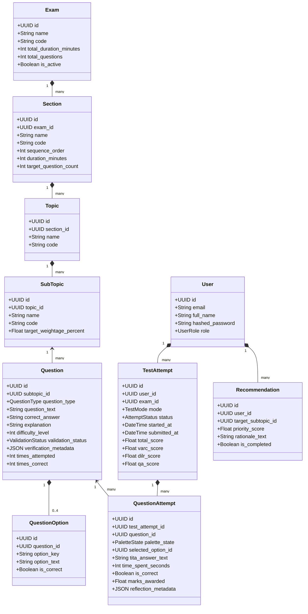

# Domain Model Specification & Entity Relationship Architecture

---

## 1. Core Domain Entities

The ExamPilot domain model captures the full lifecycle of exam creation, question generation, validation, student test taking, response tracking, and performance analytics.

```
+-------------------------------------------------------------------------------+
|                             EXAMPILOT DOMAIN GRAPH                            |
+-------------------------------------------------------------------------------+
|                                                                               |
|   [Exam] 1 ─── * [Section] 1 ─── * [Topic] 1 ─── * [SubTopic]                |
|                                                          │ 1                  |
|                                                          │ *                  |
|   [User] 1 ─── * [TestAttempt] 1 ─── * [QuestionAttempt] * ─── 1 [Question]  |
|      │                  │                                       │ 1           |
|      │ 1                │ 1                                     │ *           |
|      ▼ *                ▼ 1                             [QuestionOption]      |
| [Recommendation]   [PerformanceMetric]                                        |
|                                                                               |
+-------------------------------------------------------------------------------+
```

### Entity 1: `Exam`
* **Purpose:** Represents a standardized competitive examination structure (e.g., CAT 2026, XAT 2026).
* **Key Attributes:** `id`, `name`, `code`, `total_duration_minutes`, `total_questions`, `is_active`, `created_at`.
* **Invariants:** Must contain at least one configured `Section`.

### Entity 2: `Section`
* **Purpose:** Represents an independent, timed sectional partition within an exam (e.g., VARC, DILR, QA).
* **Key Attributes:** `id`, `exam_id`, `name`, `code`, `sequence_order` (1, 2, 3), `duration_minutes` (40), `target_question_count` (24, 20, 22).
* **Invariants:** `sequence_order` must be unique per `exam_id`. Total duration of all sections must equal `Exam.total_duration_minutes`.

### Entity 3: `Topic` & `SubTopic`
* **Purpose:** Hierarchical taxonomy categorization of the syllabus (e.g., QA $\to$ Arithmetic $\to$ Time-Speed-Distance).
* **Key Attributes:**
  - `Topic`: `id`, `section_id`, `name`, `code`, `description`.
  - `SubTopic`: `id`, `topic_id`, `name`, `code`, `description`, `target_weightage_percent`.

### Entity 4: `Question`
* **Purpose:** The fundamental test item in the question bank.
* **Key Attributes:**
  - `id`: UUID (Primary Key).
  - `subtopic_id`: Foreign Key referencing `SubTopic`.
  - `question_type`: Enum (`MCQ`, `TITA`).
  - `question_text`: Rich text with LaTeX formulas.
  - `correct_answer`: String representation of verified answer.
  - `explanation`: Step-by-step verified conceptual solution.
  - `difficulty_level`: Integer (1 to 5).
  - `validation_status`: Enum (`PENDING_VALIDATION`, `VALIDATED`, `REJECTED`).
  - `verification_metadata`: JSON (holds SymPy derivation equations, AST execution logs, and validation timestamps).
  - `times_attempted`, `times_correct`: Integer counters for empirical difficulty tracking.
* **Invariants:** If `question_type == 'MCQ'`, it must have exactly 4 associated `QuestionOption` records. Only questions with `validation_status == 'VALIDATED'` can be assembled into active test attempts.

### Entity 5: `QuestionOption`
* **Purpose:** Distractor or correct choice for an MCQ item.
* **Key Attributes:** `id`, `question_id`, `option_key` (A, B, C, D), `option_text`, `is_correct` (Boolean).
* **Invariants:** Exactly one `QuestionOption` per question must have `is_correct == True`.

### Entity 6: `User` / `Student`
* **Purpose:** The student candidate taking tests and receiving diagnostics.
* **Key Attributes:** `id`, `email`, `full_name`, `hashed_password`, `role` (`STUDENT`, `ADMIN`), `created_at`.

### Entity 7: `TestAttempt`
* **Purpose:** Represents a concrete student examination session (Mock Test or Adaptive Drill).
* **Key Attributes:**
  - `id`: UUID (Primary Key).
  - `user_id`: Foreign Key referencing `User`.
  - `exam_id`: Foreign Key referencing `Exam`.
  - `mode`: Enum (`MOCK_EXAM`, `PRACTICE_DRILL`).
  - `status`: Enum (`IN_PROGRESS`, `SUBMITTED`, `TIMED_OUT`, `ABANDONED`).
  - `started_at`, `submitted_at`: Server UTC Timestamps.
  - `current_section_id`: Section currently active.
  - `total_score`, `varc_score`, `dilr_score`, `qa_score`: Deterministically computed marks.

### Entity 8: `QuestionAttempt`
* **Purpose:** Granular per-question attempt telemetry captured during a test session.
* **Key Attributes:**
  - `id`: UUID.
  - `test_attempt_id`: Foreign Key referencing `TestAttempt`.
  - `question_id`: Foreign Key referencing `Question`.
  - `palette_state`: Enum (`NOT_VISITED`, `NOT_ANSWERED`, `ANSWERED`, `MARKED_REVIEW`, `ANSWERED_AND_MARKED`).
  - `selected_option_id`: Foreign Key referencing `QuestionOption` (nullable for TITA or unattempted).
  - `tita_answer_text`: Text input for non-MCQ questions.
  - `time_spent_seconds`: Total cumulative seconds spent on this question.
  - `is_correct`: Boolean computed upon test submission.
  - `marks_awarded`: Float (+3.0, -1.0, 0.0).
  - `reflection_metadata`: JSON (captures student elimination reason and confidence rating).

### Entity 9: `PerformanceMetric` & `Recommendation`
* **Purpose:** Analytical aggregates and adaptive action items computed post-attempt.
* **Key Attributes:**
  - `PerformanceMetric`: `id`, `test_attempt_id`, `topic_id`, `accuracy_percentage`, `avg_time_per_question`, `speed_accuracy_quadrant`.
  - `Recommendation`: `id`, `user_id`, `target_subtopic_id`, `priority_score`, `rationale_text`, `generated_at`, `is_completed`.

---

## 2. Cardinalities & Relational Invariants

| Parent Entity | Relationship | Child Entity | Cardinality | Cascade Rule |
| :--- | :---: | :--- | :---: | :--- |
| `Exam` | Contains | `Section` | $1 : N$ | On Delete Cascade |
| `Section` | Contains | `Topic` | $1 : N$ | On Delete Cascade |
| `Topic` | Subdivides into | `SubTopic` | $1 : N$ | On Delete Cascade |
| `SubTopic` | Classifies | `Question` | $1 : N$ | Restrict |
| `Question` | Has | `QuestionOption` | $1 : 4$ (for MCQ) | On Delete Cascade |
| `User` | Undertakes | `TestAttempt` | $1 : N$ | On Delete Cascade |
| `TestAttempt` | Records | `QuestionAttempt` | $1 : N$ (66 in CAT) | On Delete Cascade |
| `Question` | Evaluated in | `QuestionAttempt` | $1 : N$ | Restrict |
| `TestAttempt` | Yields | `PerformanceMetric` | $1 : N$ | On Delete Cascade |
| `User` | Receives | `Recommendation` | $1 : N$ | On Delete Cascade |

---

## 3. Domain Class Diagram (Mermaid)



---

## 4. Viva Defense Notes
* *"The domain model explicitly decouples the abstract examination taxonomy (`Exam` $\to$ `Section` $\to$ `Topic` $\to$ `SubTopic`) from operational student sessions (`TestAttempt` $\to$ `QuestionAttempt`). This ensures that an attempt is an immutable historical snapshot: even if a question's explanation or difficulty is refined later in the question bank, a student's prior test attempt preserves the exact answers and scores recorded at that point in time."*
