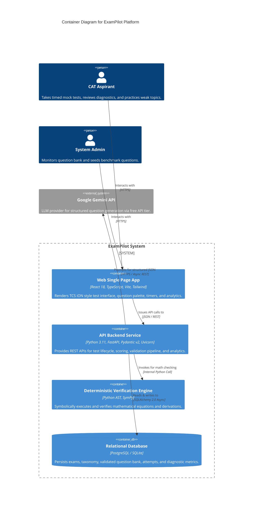
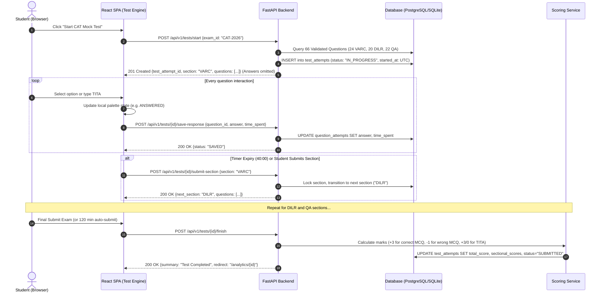
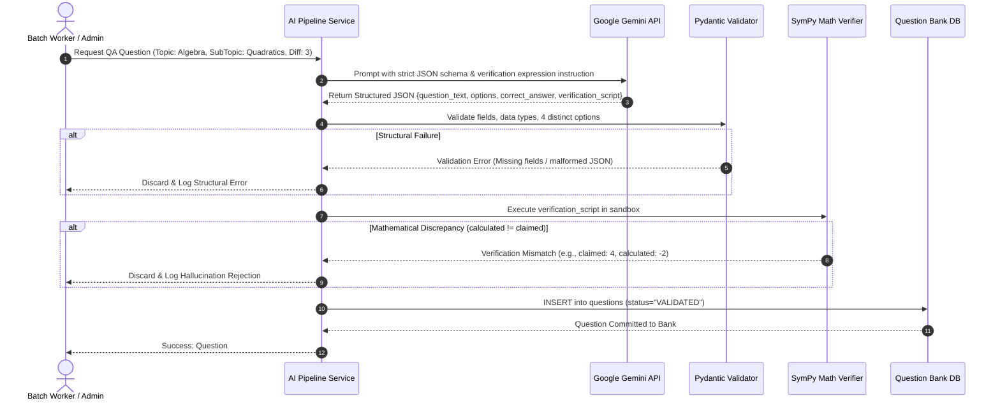

# System Architecture & Technical Design Specification

---

## 1. Architectural Options Comparison & Evaluation

Before committing to code, we evaluate three candidate architectures across seven academic and operational criteria:

| Evaluation Criterion | Option A: Monolithic Flask + Jinja2 Templates | Option B: FastAPI Backend + React/TypeScript SPA | Option C: Full-Stack Next.js (TypeScript) |
| :--- | :--- | :--- | :--- |
| **1. Asynchronous I/O & Concurrency** | Poor (WSGI synchronous model blocks threads during LLM calls) | **Excellent** (Native ASGI event loop handles async LLM I/O and DB streaming) | Good (Node.js event loop handles async, but lacks native Python scientific libraries) |
| **2. Deterministic Verification Integration** | Good (Direct Python access to `SymPy` and math libraries) | **Excellent** (Direct Python execution with typed Pydantic v2 schemas) | Poor (Requires spawning child Python processes or separate microservice for `SymPy`) |
| **3. Complex Client State Management** | Poor (Full page reloads or fragmented jQuery for 66-question CAT palette) | **Excellent** (React component state machine manages palette, countdown, and auto-save seamlessly) | **Excellent** (React-based component state management) |
| **4. Team Collaboration Suitability** | Moderate (Both developers touch server templates, high risk of merge conflicts) | **Ideal for 2 Students** (Strict separation of concerns: Lakshya on Backend/AI, Vaibhav on Frontend/UI) | Moderate (Shared frontend/backend files can cause merge overlaps) |
| **5. Type Safety & Validation** | Low (Requires manual schema checks or external libraries) | **High** (Pydantic v2 on backend + TypeScript interfaces on frontend) | Moderate (TypeScript on frontend/backend, but no native Python math types) |
| **6. Development Velocity** | Fast at start, slow as state complexity grows | **High & Predictable** (OpenAPI / Swagger documentation synchronizes team contracts) | High for general web, cumbersome for scientific Python bindings |
| **7. Academic Rigor & Viva Defensibility** | Low (Looks like a legacy tutorial application) | **High** (Demonstrates decoupled REST architecture, clean separation of concerns, and type-safe contracts) | Moderate (Often dismissed as a monolithic web app) |

### Recommendation & Justification
**Option B (FastAPI + React/TypeScript)** is unequivocally recommended. It combines Python's rich scientific and symbolic ecosystem (`SymPy`, `NumPy`, `Pydantic`) for the AI and validation pipelines with React's event-driven component model for the timed CAT question palette, while cleanly dividing ownership between two student developers.

---

## 2. High-Level Architecture (C4 Container Diagram)



---

## 3. Subsystem Component Architecture

### 3.1 Backend Internal Component Decomposition
The FastAPI application is modularized into distinct architectural layers following Clean Architecture / Hexagonal principles:

```
backend/app/
├── core/               # Configuration (Settings via Pydantic, Security, Logging)
├── db/                 # Database session management, Base declarative model
│   └── models/         # SQLAlchemy 2.0 mapped relational tables
├── schemas/            # Pydantic v2 request/response & validation schemas
├── api/                # FastAPI Routers (v1)
│   ├── auth.py         # Authentication & student profile endpoints
│   ├── exams.py        # Exam taxonomy & configuration endpoints
│   ├── tests.py        # Mock test session lifecycle & submission endpoints
│   ├── questions.py    # Question retrieval & bank management
│   ├── analytics.py    # Diagnostic scorecard & pacing endpoints
│   └── adaptive.py     # Weakness recommendation & drill generation endpoints
├── services/           # Pure Business Logic
│   ├── test_engine.py  # Test session creation, countdown authority, and state machine
│   ├── scoring.py      # Deterministic CAT scoring (+3/-1, TITA rules)
│   ├── analytics.py    # Aggregation queries for accuracy, speed, and time-sinks
│   └── recommender.py  # Algorithmic topic weakness prioritization
└── ai_pipeline/        # Generative & Verification Core
    ├── provider.py     # Base abstract LLM interface & Gemini implementation
    ├── prompts.py      # Structured prompt templates with schema instructions
    ├── parser.py       # Pydantic JSON parser & distractor validator
    └── math_verifier.py# SymPy symbolic solver and equation verifier
```

---

## 4. Primary Data Flow Diagrams

### 4.1 Mock Test Taking & Scoring Lifecycle


### 4.2 AI Question Generation & Deterministic Validation Pipeline


---

## 5. Deployment Architecture (Local Zero-Budget & Demonstration Setup)

```mermaid
graph TD
    subgraph Developer / Examination Machine
        Browser["Modern Web Browser (Chrome/Firefox/Edge)"]
        
        subgraph Frontend Server
            ViteDev["Vite Local Dev Server (:5173)"]
        end
        
        subgraph Backend Server
            Uvicorn["Uvicorn ASGI Server (:8000)"]
            FastAPIApp["FastAPI Application"]
        end
        
        subgraph Local Persistence
            SQLiteDB[("SQLite WAL Database File (./data/local/exampilot.db)")]
        end
    end

    subgraph External Cloud Services (Zero-Cost Free Tier)
        GeminiAPI["Google Gemini Generative AI API (REST/HTTPS)"]
    end

    Browser -->|Port 5173| ViteDev
    Browser -->|API Calls :8000| Uvicorn
    Uvicorn --> FastAPIApp
    FastAPIApp -->|aiosqlite| SQLiteDB
    FastAPIApp -->|Async HTTPS| GeminiAPI
```

---

## 6. Viva Defense Notes
* *"We adopted a decoupled client-server architecture with FastAPI and React. The frontend operates as a state machine managing rapid user inputs and local timer synchronizations, while the backend maintains authoritative time tracking, deterministic scoring, and background question verification. This separation of concerns guarantees that AI network latency cannot impact the test-taking experience."*
