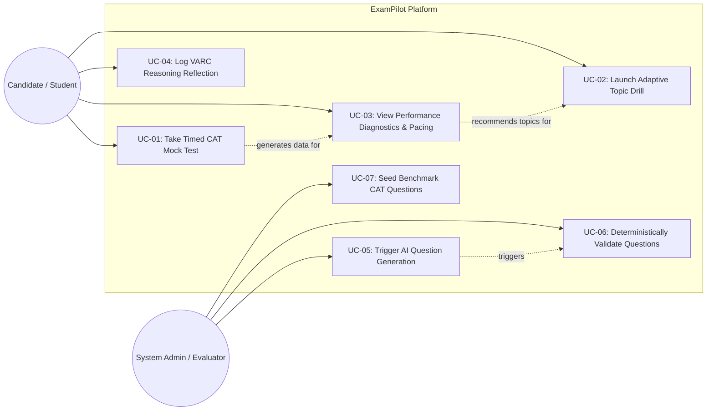

# Use Case Model & User Personas

---

## 1. User Personas

### Persona 1: Aarav Sharma (The Serious CAT Aspirant)
* **Demographics:** 21 years old, Final-year B.Tech student, aiming for IIM Ahmedabad / Bangalore (99.5+ percentile target).
* **Pain Points:** 
  - Exhausted static test series from commercial coaching portals (TIME/IMS).
  - Struggles with section pacing in QA: spends 4+ minutes on deceptive algebra questions and runs out of time for easy arithmetic.
  - Frustrated when AI practice tools present questions with wrong answers or fake formulas.
* **Goal:** Practice realistic 40-minute sectional mocks with instant pacing diagnostics and zero hallucinated answer keys.

### Persona 2: Priya Verma (The Conceptual Builder)
* **Demographics:** 22 years old, Non-engineering background (B.Com graduate), preparing for CAT.
* **Pain Points:**
  - Low accuracy in Quantitative Ability (specifically Number Systems and Geometry).
  - Overwhelmed by taking full 120-minute mocks repeatedly without targeted remediation.
  - In VARC, repeatedly falls for Reading Comprehension "inference traps" but cannot tell why her elimination logic failed.
* **Goal:** Target specific weak sub-topics with untimed adaptive drills that explain *why* an answer is right and diagnose elimination mistakes.

---

## 2. Use Case Diagram (Mermaid)

---

## 3. Detailed Use Case Specifications

### UC-01: Take Timed CAT Mock Test
* **Primary Actor:** Student
* **Preconditions:**
  - Student is registered in the system.
  - The Question Bank contains at least 66 validated questions satisfying CAT sectional distribution (24 VARC, 20 DILR, 22 QA).
* **Main Success Scenario (Happy Path):**
  1. Student selects "Take Full CAT Mock Test" and clicks "Start Exam".
  2. System initializes a new test attempt, records server start timestamp, and displays Section 1 (VARC) with a 40:00 countdown timer.
  3. Student reads questions, selects MCQ options or enters TITA values, and marks questions for review via the Question Palette.
  4. System continuously auto-saves candidate answers asynchronously on the server.
  5. Upon timer expiry (`00:00`), Section 1 automatically submits and locks. System immediately presents Section 2 (DILR).
  6. Repeat for Section 2 and Section 3 (QA).
  7. Upon completion of QA (or explicit early final submit), the system locks the exam, executes the CAT scoring engine, and redirects the student to the comprehensive performance scorecard.
* **Alternative / Exception Flows:**
  - **E-01 (Browser Crash / Tab Closure):** Student reopens the exam URL. System calculates remaining time as: $\text{Current Server Time} - \text{Section Start Time}$. If time remains, session resumes seamlessly with all previous answers intact. If time expired, the section is auto-submitted.
* **Postconditions:** Complete historical attempt recorded; all question states, selected answers, and sectional scores persisted in the database.

---

### UC-02: Launch Adaptive Topic Drill
* **Primary Actor:** Student
* **Preconditions:** System question bank has validated questions in the chosen topic/sub-topic.
* **Main Success Scenario:**
  1. Student selects "Practice Mode" $\to$ selects "Quantitative Ability" $\to$ "Arithmetic" $\to$ "Time, Speed & Distance" $\to$ "Difficulty: Level 3 (CAT Standard)".
  2. Alternatively, student clicks "Practice My Weaknesses", and the system auto-selects the student's lowest-accuracy topic based on past attempts.
  3. System serves questions one by one.
  4. Student submits an answer.
  5. System immediately reveals correctness, earned marks, and the complete step-by-step symbolic derivation and explanation.
  6. Student moves to the next question or finishes the drill.
* **Postconditions:** Practice session attempt logged in database and factored into longitudinal topic-accuracy metrics.

---

### UC-03: Generate & Deterministically Validate Questions
* **Primary Actor:** System (Automated) / Administrator
* **Preconditions:** Valid API key configured; SymPy execution environment initialized.
* **Main Success Scenario:**
  1. Generation pipeline issues a structured prompt request to the LLM for a target section, sub-topic, and difficulty level.
  2. LLM returns structured JSON payload matching the target schema.
  3. Pipeline validates syntax and structure against the `Pydantic` model.
  4. For QA questions: Pipeline parses the mathematical expression, executes symbolic solving in `SymPy`, and verifies that `calculated_solution == claimed_answer`.
  5. Pipeline verifies distractor uniqueness (all 4 options distinct).
  6. Pipeline commits the verified question to the database with status `VALIDATED`.
* **Alternative / Exception Flows:**
  - **E-01 (LLM Hallucination / Math Discrepancy):** `SymPy` calculated answer does NOT match the LLM's designated correct answer. The pipeline logs a validation error, discards the candidate question, and initiates an automatic retry prompt.
  - **E-02 (Rate Limit HTTP 429):** Pipeline catches API error, applies exponential backoff, and retries up to 3 times before pausing batch generation.
* **Postconditions:** Only 100% verified questions are added to the active question bank.

---

### UC-04: View Performance Diagnostics & Pacing Report
* **Primary Actor:** Student
* **Preconditions:** Student has completed at least one Mock Test or Practice Drill.
* **Main Success Scenario:**
  1. Student navigates to the "Analytics & Diagnostics" dashboard.
  2. System loads aggregated performance metrics:
     - Sectional and overall scores with CAT marking rubrics.
     - Topic-wise accuracy breakdown (e.g., Arithmetic: 80%, Algebra: 45%).
     - Time spent per question vs. accuracy (identifying time-sink questions).
     - Speed-Accuracy categorization matrix.
     - Actionable diagnostic summary highlighting primary areas of mark leakage.
  3. Student clicks on an identified weakness to directly launch a remediation practice session.
* **Postconditions:** Diagnostic insights presented clearly with actionable next steps.

---

### UC-05: Log Qualitative VARC Reasoning Reflection
* **Primary Actor:** Student
* **Preconditions:** Student is in Practice Mode or reviewing a completed test's VARC section.
* **Main Success Scenario:**
  1. Student reviews an incorrect Reading Comprehension question.
  2. System presents an optional reflection prompt: *"Why did you select this option?"*
     - [ ] Thought it was directly mentioned in the passage
     - [ ] Inferred from author's tone
     - [ ] Eliminated all other options
     - [ ] Guessed between two remaining choices
  3. Student selects their reason and indicates confidence level (High / Medium / Low).
  4. System records the cognitive reflection and contrasts it with the verified explanation (e.g., identifying when an option was an "out-of-scope distortion").
* **Postconditions:** Reflection data stored for aggregate cognitive pattern reporting.
